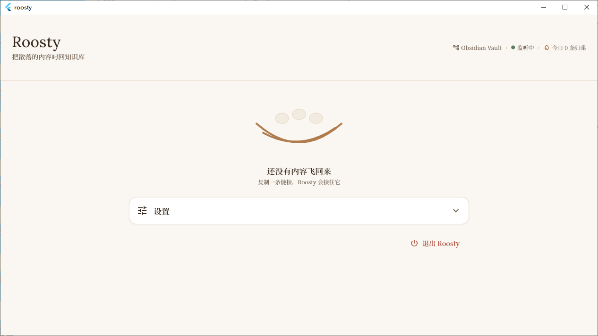

# Roosty

> 把散落各处的内容「叼回」你自己的知识库。

Roosty 是一个 **local-first** 的「内容归巢」工具：在桌面上复制一条链接，它自动抓取正文、用 AI 生成摘要和标签，归档成带 YAML frontmatter 的 Markdown，直接写进你的 Obsidian 库。

- **数据完全本地**：不经过任何云服务，直接写 `.md` 到你的 vault。
- **自带 AI 摘要**：写入前调用你自己的 LLM（OpenAI 兼容端点）生成摘要 + 自动标签。
- **v1 桌面优先**：当前发布版只交付 Windows 桌面端（剪贴板捕获）。Android 代码已存在于仓库中但**暂缓**未启用，等待恢复条件触发；详见 [`DECISIONS.md`](./DECISIONS.md)。
- **对话留给 Obsidian**：Roosty 只负责产出优质 md，RAG/对话交给 Obsidian 的 Copilot 等插件。

## 核心流程

```
复制链接  →  抓取正文+元数据  →  AI 摘要+标签  →  写入 <vault>/Roosty/*.md
 (Source)      (Fetcher)         (Processor)         (Sink)
```

桌面后台监听剪贴板，检测到 URL 弹确认 → 归档（默认关闭，首次启动引导开启）。

> v1 不交付移动端体验。仓库内的 `share_intent_source.dart` / `android_saf_vault.dart` / `android/` 工程目录均为**冻结保留**的未来恢复资产，不会随 v1 一起编译分发。

## 快速上手（约 30 分钟）

### 1. 环境

- [Flutter](https://flutter.dev) stable（Dart 3.x）
- Windows：Visual Studio（含 C++ 桌面开发负载）

> **Windows 用户注意**：项目路径请使用**纯 ASCII 路径**（如 `C:\roosty`）。
> `super_native_extensions`（剪贴板底层，含 Rust 构建）在含中文/非 ASCII 字符的路径下会构建失败。

### 2. 运行

```bash
flutter pub get
flutter analyze        # 应 No issues found
flutter test           # 应全部通过
flutter run -d windows # v1 仅交付 Windows 桌面
```

### 3. 配置

首次启动在设置页：

1. **Vault 路径**：选择你的 Obsidian 库目录（内容会写到 `<vault>/Roosty/`）。
2. **剪贴板监听**（桌面，可选）：开启后复制链接会弹确认。
3. **LLM**（可选，用于 AI 摘要）：填 OpenAI 兼容端点三件套：
   - Base URL：默认示例 `https://api.deepseek.com`
   - API Key：你自己的 key（**绝不内置托管 key**）
   - Model：默认示例 `deepseek-chat`

> 未配置 LLM 时，Roosty 照常归档，只是不生成 AI 摘要。

## 截图

> 即将补齐：4 张光/暗主题下的主屏与 mini card 截图。
> 截图占位文件位于 [`docs/screenshots/`](./docs/screenshots/)。

| 主屏（光） | 主屏（暗） |
|:---:|:---:|
|  |  |
| **mini card（光）** | **mini card（暗）** |
|  |  |

## 从源码构建

```powershell
# 一次性环境检查
flutter doctor

# 打包 Windows 可分发版本（产物在 dist/）
.\scripts\build-windows.ps1
```

Roosty 不依赖运行时下载、不调用云服务（除非你配了 LLM key），所以打包后可直接放进任何 Windows 10/11 机器运行。

## 生成的 Markdown 格式

```markdown
---
title: "文章标题"
source: web            # wechat | x | xiaohongshu | video | web
url: https://...
author: "原作者"
captured: 2026-06-15T12:30:00+08:00
summary: "AI 一句话摘要"
tags: [roosty/inbox]
status: unread
---

# 文章标题
> 来源：网页 · [原文链接](https://...)
## 摘要
（AI 摘要）
## 原文
（抓到的正文，抓不到则留链接占位）
```

字段全部兼容 Obsidian Dataview，方便检索和聚合。

## 架构

可插拔的单向数据流，按接口编程：

| 抽象 | 职责 | 实现 |
|------|------|------|
| `Source` | 产生原始输入 | ClipboardSource（桌面）；ShareIntentSource ⏸ 冻结 |
| `Fetcher` | 从 URL 抓正文+元数据 | WebFetcher（readability 式提取） |
| `Processor` | 加工 Item | SummarizeProcessor（LLM 摘要+标签） |
| `Sink` | 输出 | ObsidianSink（写 .md）；AndroidSafVault ⏸ 冻结 |

## Roadmap

- [ ] **恢复 Android 端**：v1 暂缓的代码已冻结在仓库中；恢复条件见 [`DECISIONS.md`](./DECISIONS.md) §移动端暂缓
- [ ] 平台专用 Fetcher：微信防盗链 / 小红书无头渲染 / X（走轻后端）
- [ ] iOS Share Extension + macOS
- [ ] 浏览器扩展一键剪藏
- [ ] 更多 Sink（Notion 等）

## License

[MIT](./LICENSE)
